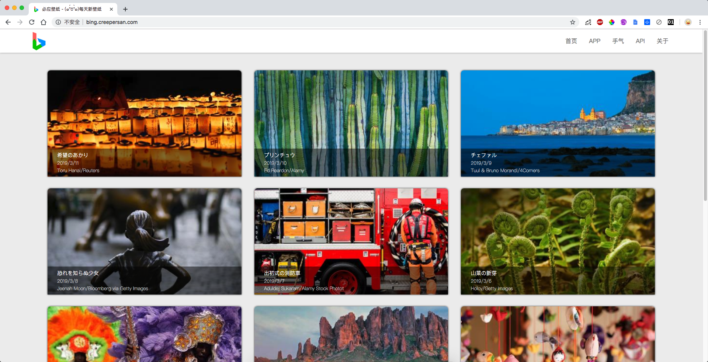
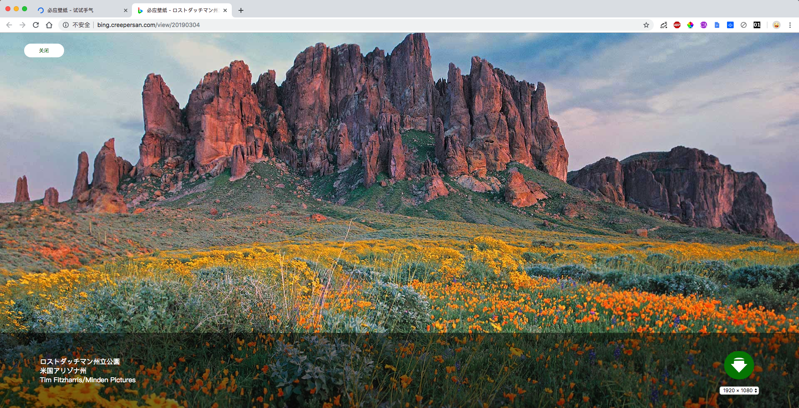

# Bing Image

A website that gets Bing search's background images every day.

一个每天获取必应搜索背景壁纸的网站。

Visit : [http://bing.creepersan.com](http://bing.creepersan.com)

PS : The website address above may open very slow because I used the lowest price's VPS…sorry about that... 

PS : 上面的网址可能打开会很慢，因为我用的是最便宜的VPS…请见谅...

## Quick Start

1. Make sure you device have install `MySQL` and `Node.js`.

   确保你安装了`MySQL`和`Node.js`

2. Download the latest [release](https://github.com/CreeperSan/bing-image/releases) and prepare a database that used to save some data.

   从[这里](https://github.com/CreeperSan/bing-image/releases)下载最新的压缩包并创建一个数据库用于保存数据

3. Unzip the packet and `cd` into the folder you get

   解压缩你刚刚下载的文件并`cd`进入文件夹中

4. Open `config.js` and setup these fields `database_host` , `database_user` , `database_password` , `database_name` , `app_location`. (Currently only support China and Japan)

   打开`config.js`并配置下列这些字段`database_host`、`database_user`、`database_password`、`database_name`、`app_location`（目前仅支持中国和日本两个地区的数据解析）

5. Run script `npm start`

   在控制台中执行`npm start`命令

6. Now the website will start at `localhost:3001`

   然后你就可以访问`localhost:3001`来看到这个网页咯

## Screenshot

## Android Applicaiton

Check [here](https://github.com/CreeperSan/bing-image-android)

## License

MIT