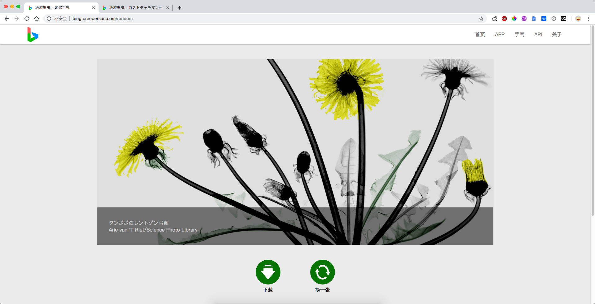

# 必应壁纸

[简体中文](/README.md)  [English](/README_EN.md)

一个每天获取必应搜索背景壁纸的网站。

点击访问 : [http://bing.creepersan.com](http://bing.creepersan.com)

PS : 上面的网址可能打开会很慢，因为我用的是最便宜的VPS…请见谅...

## 运行环境

Node.js

MySQL

## 快速开始

1. 在MySQL中创建一个用于保存壁纸信息的数据库
2. 从[这里](https://github.com/CreeperSan/bing-image/releases)下载最新的压缩包并创建一个数据库用于保存数据
3. 解压缩你刚刚下载的文件并`cd`进入文件夹中
4. 运行`npm install`
5. 运行 `npm run init` 按照提示输入 地区以及数据库信息
6. 然后你就可以访问`localhost:3000`来看到这个网页咯`

## 其他指令

+ `npm run backup` 进行数据备份(测试功能)
+ `npm run restore 备份文件路径 ` 进行数据恢复(测试功能)

## 截图预览

## Android 应用程序

[点击这里](https://github.com/CreeperSan/bing-image-android)

## License

MIT