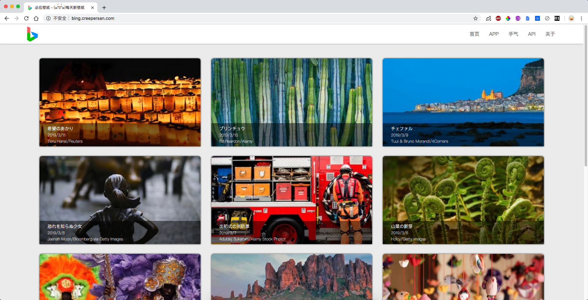
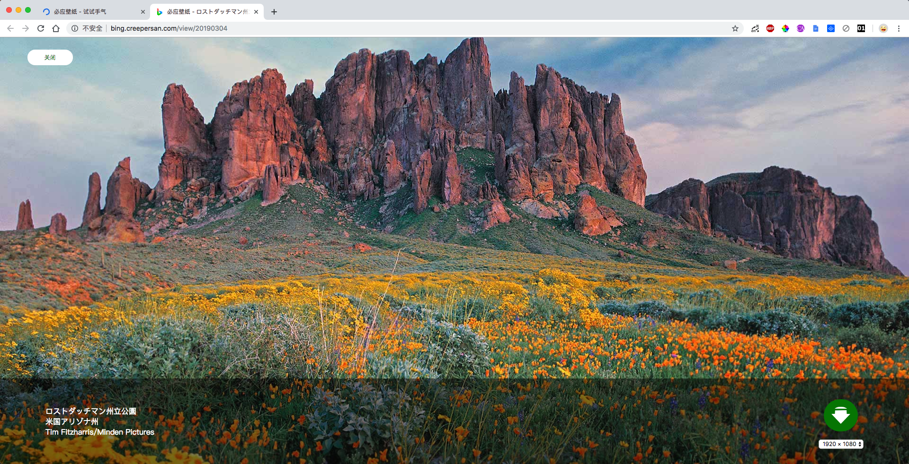
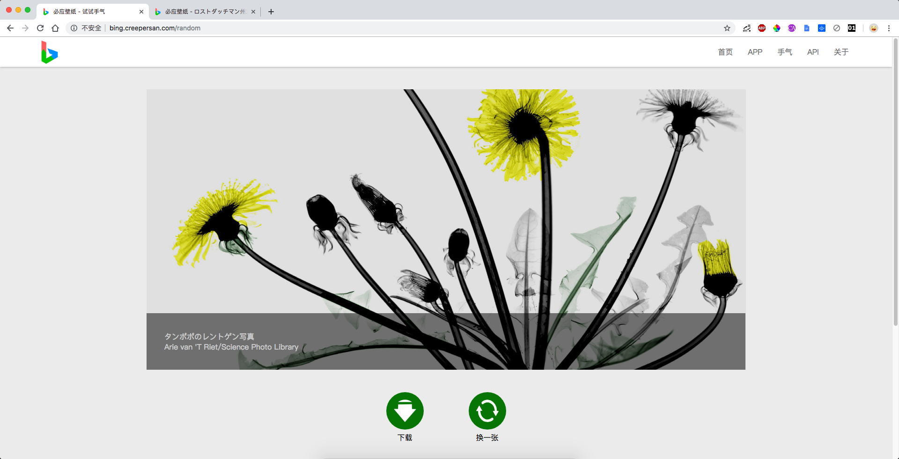

# Bing Image

[简体中文](/README.md)  [English](/README_EN.md)

A website that gets Bing search's background images every day.

Visit : [http://bing.creepersan.com](http://bing.creepersan.com)

PS : The website address above may open very slow cuz I'm using the lowest price's VPS…

## Enviroment

Node.js

MySQL

## Quick Start

1. Create a database to save wallpaper informations
2. Download the latest [release](https://github.com/CreeperSan/bing-image/releases) and prepare a database that used to save some data.

3. Unzip the packet and `cd` into the folder you get

4. Run `npm install`
5. Run `npm run init` to run initialize wizard
6. Run `npm start` , then the server will start at `localhost:3000`

## Screenshot

## Android Applicaiton

Check [here](https://github.com/CreeperSan/bing-image-android)

## License

MIT